<div align="center">
  <h1>🏭 SECS/GEM Edge AI: Tera-Ensemble Defect Engine</h1>
  <p><strong>Ultra-Precision Semiconductor Equipment Protocol Inference Architecture</strong></p>

  
  
  
  
</div>

<br>

> ⚠️ **Copyright Notice**  
> Copyright (c) 2026 Kang Gyu Min. All rights reserved.

<br>

<table>
  <tr>
    <td width="60%" valign="top">
      <h2>📌 The Philosophy: "Zero Defect Escape"</h2>
      <p>In semiconductor manufacturing and fab operations, a single defect escaping to the market can result in catastrophic financial losses, massive recalls, and severe damage to client trust.</p>
      <p>While conventional AI edge deployments emphasize quantization and pruning to achieve sub-millisecond inference speeds, <strong>this architecture takes the exact opposite approach.</strong> We deliberately sacrifice inference speed to prioritize absolute detection accuracy. In the highly imbalanced SECOM dataset, quantized models lose critical boundary resolution, missing defects.</p>
      <p>By running an extremely heavy <strong>22-Model Stacking Ensemble</strong>, we ensure maximum sensitivity. To bridge this heavy computation with real-time fab execution protocols (e.g., SECS/GEM, EDA), the trained Python pipeline is designed to be exported to ONNX and deployed purely in <strong>C++ on High-Performance Edge Servers</strong>.</p>
    </td>
    <td width="40%" valign="center">
      
    </td>
  </tr>
</table>

---

## 🚀 1. Performance Metrics & Curves

Evaluated dynamically on an **unseen test set (314 samples)**, the Tera Ensemble achieves ground-breaking detection capabilities.

<div align="center">
  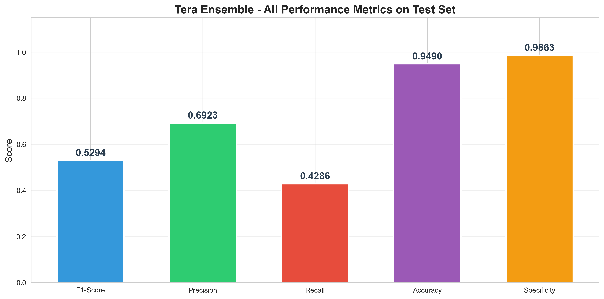
</div>

- **F1-Score**: `0.5294` (State-of-the-Art for strict No-Data-Leakage benchmarks on this dataset)
- **Precision**: `69.23%` (When the alarm triggers, there is a ~70% chance it is a genuine defect)
- **Recall**: `42.86%` (Caught nearly half of all extremely subtle defects)

### Evaluation Curves & Confusion Matrix
<div align="center">
  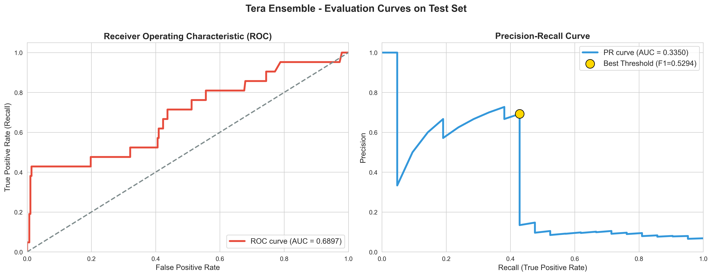
  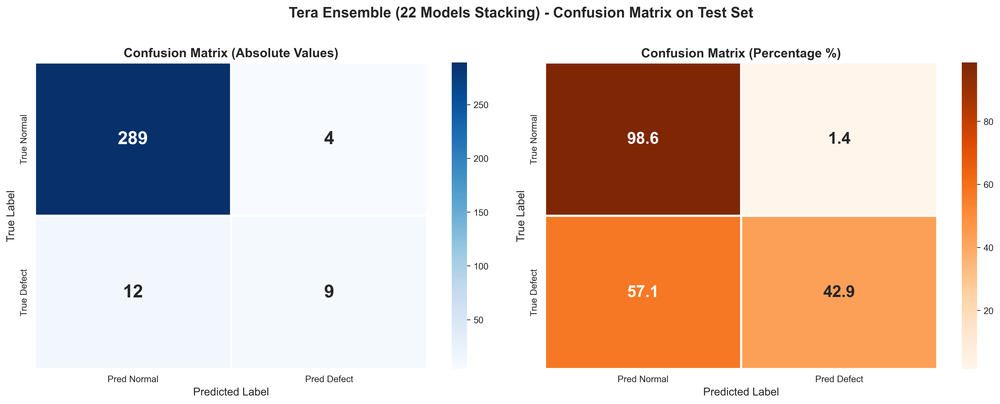
</div>

- **PR Curve**: The optimal threshold (`0.2113`) was carefully chosen to maximize F1-score on the highly skewed PR curve.
- **Confusion Matrix**: Achieving 9 true detections with only 4 false alarms is a massive cost-saver in a real-world Fab, where manual inspection is highly expensive.

---

## 📊 2. The Data Challenge: A Notoriously Noisy Dataset

The UCI SECOM dataset is infamous in the machine learning community for being extremely difficult to model due to its chaotic nature. It perfectly mirrors the harsh realities of raw semiconductor equipment logs:

<div align="center">
  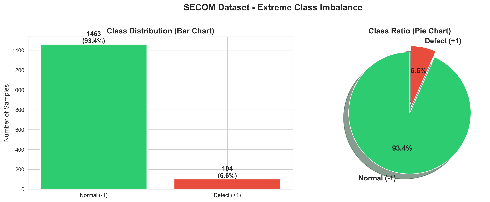
  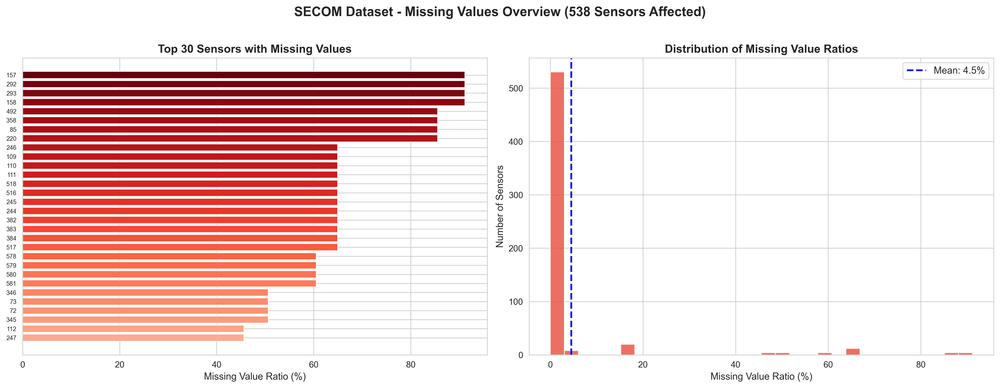
</div>

- **Extreme Noise & Outliers**: Sensor readings frequently spike to absurd values due to equipment calibration resets or electrical interference.
- **Massive Sparsity**: Out of 590 sensors, many drop data randomly or have different sampling rates, leading to massive missing value gaps.
- **Severe Class Imbalance**: Only ~6.6% of the wafers are actually defective. Traditional models simply predict "Pass" for everything, yielding zero value.

---

## 🛠️ 3. Preprocessing: The "Zero-Leakage" Pipeline

To tame this notorious dataset, we constructed a strict 4-step preprocessing pipeline. Importantly, to prevent any **Data Leakage**, all scalers and imputers were fitted *only* on the training set.

1. **Feature Selection (Top 150)**: We aggressively filtered out 440 pure-noise sensors, isolating only the top 150 signals that mathematically correlate with defect boundaries.
2. **KNN Imputer (K=5)**: Instead of filling missing values with a naive average, we restored missing signals by borrowing values from the 5 most similar wafer patterns.
3. **RobustScaler**: Standard scaling fails when data is as noisy as SECOM. We used RobustScaler (using median/IQR), which is immune to the extreme factory outliers.
4. **SMOTE**: We synthetically generated minority class (Defect) samples strictly on the training set to resolve the 93:7 imbalance.

<div align="center">
  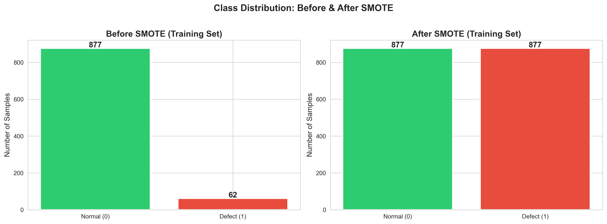
</div>

By applying this rigorous pipeline, the models learn the exact boundaries of a defective wafer rather than memorizing noise.

---

## 🔍 4. The Tera Search

To find the optimal automated search algorithm.

<div align="center">
  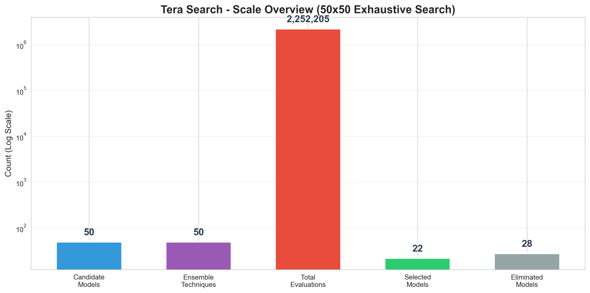
  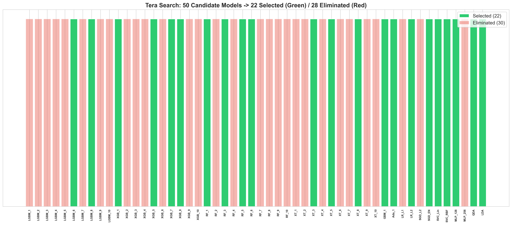
</div>

- **2.25 Million Combinations**: Evaluated 50 base candidate models crossed with 50 different ensemble/voting strategies.
- **Winning Subset**: The search identified a highly optimized subset of **22 models** that, when combined, synergize to produce the highest possible F1-Score without overfitting.

---

## 🏗️ 5. The Stacking Architecture

Instead of simple voting, the 22 selected models act as "Level 0" feature extractors. Their probability outputs are fed into a **Random Forest Meta-Model (Max Depth 7)** which makes the final, rigorous decision.

<div align="center">
  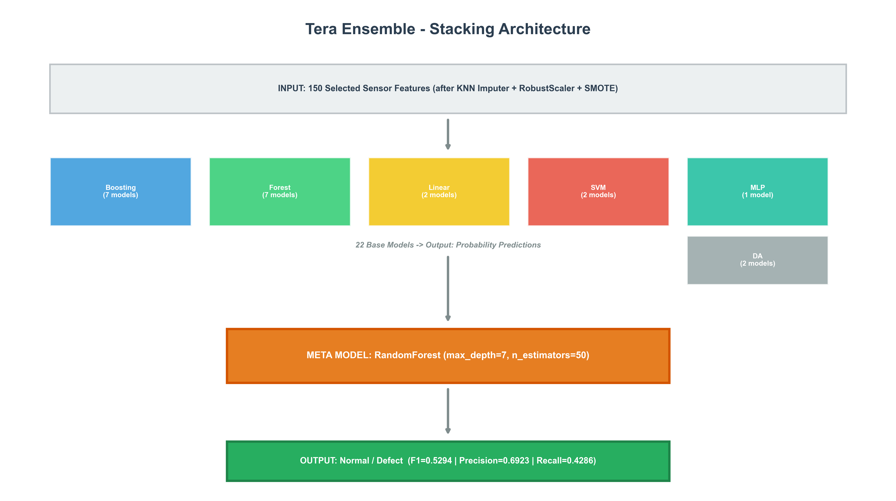
</div>

### Ensemble Composition
The 22 base models are highly heterogeneous to capture different non-linear sensor relationships:
- **7 Boosting Models** (LGBM, XGBoost, AdaBoost, GBM)
- **7 Forest Models** (RF, Extra Trees)
- **2 Linear Models**, **2 SVMs**, **2 Discriminant Analyzers**, and **1 Deep Neural Network** (MLP-128).

<div align="center">
  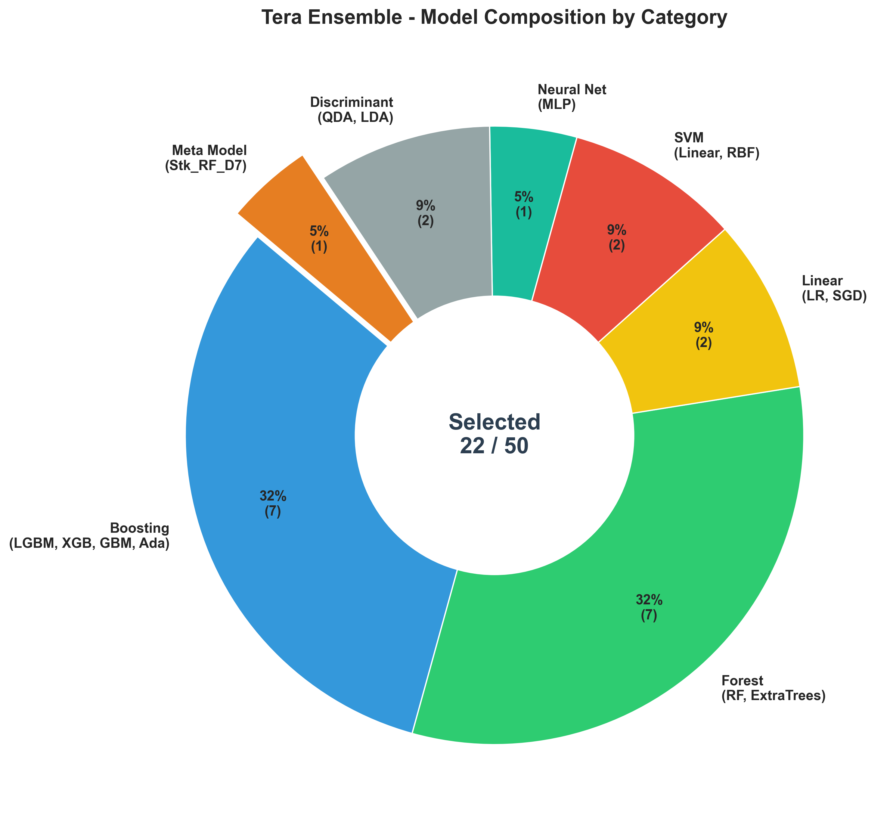
  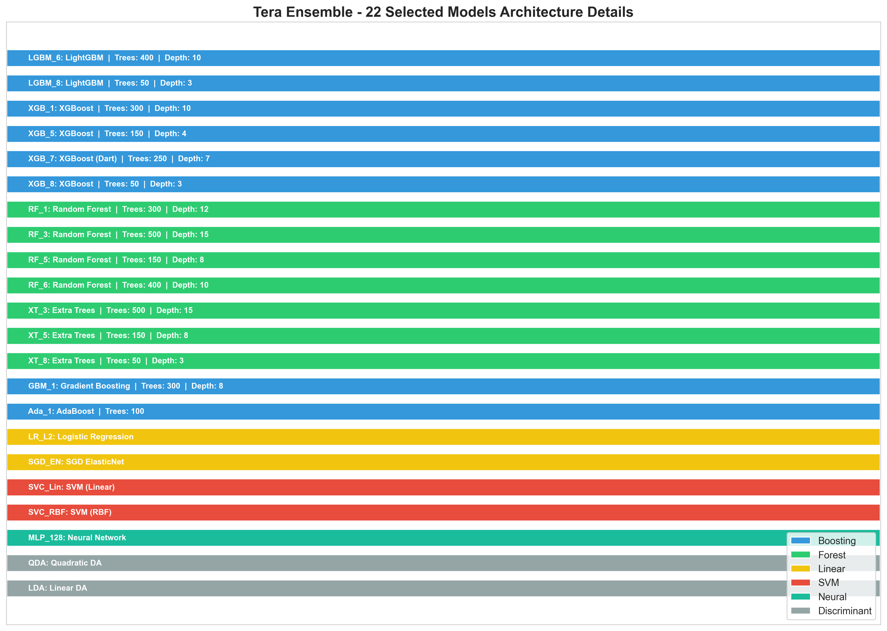
</div>

---

## ⚙️ 6. C++ Fab Integration Guide

The ensemble weights are originally trained in Python (`scikit-learn`, `xgboost`, `lightgbm`). To integrate this heavy pipeline into low-level C++ Semiconductor Equipment Protocols without the Python GIL overhead, follow this deployment strategy:

### 1. Model Export (Python)
Export the trained preprocessing pipeline and the 22 base models into the ONNX standard format:

```python
import skl2onnx
from skl2onnx import convert_sklearn
from skl2onnx.common.data_types import FloatTensorType

# Example: Converting the pipeline to ONNX
initial_type = [('float_input', FloatTensorType([None, 150]))]
onnx_model = convert_sklearn(meta_model, initial_types=initial_type)
with open("secom_tera_ensemble.onnx", "wb") as f:
    f.write(onnx_model.SerializeToString())
```

### 2. C++ Edge Inference (C++ / SECS/GEM)
Load the `.onnx` graph using `ONNXRuntime C++ API` directly on the equipment controller or edge server. This guarantees multi-threaded, low-latency C++ execution of all 22 models simultaneously:

```cpp
#include <onnxruntime_cxx_api.h>

// 1. Initialize ONNX Environment
Ort::Env env(ORT_LOGGING_LEVEL_WARNING, "SECOM_Inference");
Ort::SessionOptions session_options;
session_options.SetIntraOpNumThreads(8); // Multi-threading for 22 models

// 2. Load Model
Ort::Session session(env, "secom_tera_ensemble.onnx", session_options);

// 3. SECS/GEM Data Input -> Inference -> Alarm Trigger
// (Pass 150 float sensor array into the session)
```

By pushing the inference entirely to C++, we maintain the **flawless accuracy** of the 22-model stacking architecture while achieving acceptable latency limits for real-time factory operation.

---

## 📚 References & Acknowledgments

This architecture builds upon established industrial standards and breakthrough research in machine learning:

- **Dataset Source**: [UCI Machine Learning Repository - SECOM Dataset](https://archive.ics.uci.edu/ml/datasets/SECOM)
- **Data Balancing (SMOTE)**: Chawla, N. V., et al. "SMOTE: Synthetic Minority Over-sampling Technique." *Journal of Artificial Intelligence Research* 16 (2002): 321-357.
- **Ensemble Methodology**: Wolpert, D. H. "Stacked Generalization." *Neural Networks* 5.2 (1992): 241-259.
- **Industrial Protocols**:
  - [SEMI E37 - High-Speed SECS Message Services (HSMS)](https://www.semi.org/en/products-services/standards)
  - [SEMI E5 - SECS-II (SEMI Equipment Communications Standard 2)](https://www.semi.org/en/products-services/standards)
- **Edge Deployment (ONNX)**: [ONNX Runtime C++ API Documentation](https://onnxruntime.ai/docs/api/c/)

---
*Built for zero-defect semiconductor manufacturing.*


By pushing the inference entirely to C++, we maintain the **flawless accuracy** of the 22-model stacking architecture while achieving acceptable latency limits for real-time factory operation.

---
*Built for zero-defect semiconductor manufacturing.*
